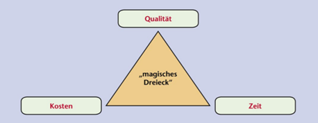

# Projekmanagement
- ## Definition
  - Projekt ist einmaliges Vorhaben mit klarem Ziel und einem definierten Anfang und Ende Termin. Also ist Zeitlich befristet. 
- ## Kenngrößen des Projekts 
  -  Kenngrößen ist dafür, den Fortschrift, den Erfolg und Wirksamkeit eines Projekts zu messen und bewerten.
     - Zeit (每个步骤进度所需的事件)
     - Kosten (所有的人工，材料和设备成本)
     - Qualität (是否符合标准)
     - Umfang (范围，项目需要完成的任务)
     - Risiko (潜在的危险)
     - Fortschritt (进度)
- ## Magischen Dreieck
  
- ## SMART
  - Damit Manager Fokus auf wesentliche Sache legen kann und Projekt Effektiver ausführen kann.

  - S ===> 	spezifisch (Ziel sollte konkrete und spezifisch wie möglich formulieren)
  - M	===>	messbar (Ziel sollte so definieren, dass Fortschritt nachfolgen kann)
  - A	===>	attraktiv (Ziel sollte für allem reizvoll)
  - R	===>	realistisch (Ziel sollte umsetzbar)
  - T	===>	terminiert (Ziel sollte zeitlich geplant werden)
- ## Stakeholder
  -	Projektleiter
  -	Projektmitarbeiter
  -	Kunden
  -	Benutzer
  -	Auftraggeber
  -	Sponsoren (赞助商)
- ## Projektphasen
  -	Projektauftrag / Definition
  -	Projektplanung
  -	Projektdurchführung
  -	Überwachung und Testen
  -	Projektabschluss
- ## Aufgaben von Projektmanagement
  -	Planung
  -	Organisation
  -	Personaleinsatz
  -	Führung
  -	Kontrolle
- ## Gantt-Diagramm
- ## Netzplan
- ## Kritscher Pfad
- ## Wasserfallmodell
  - ### Dokumentgetrieben (Wasserfall auch Dokumentgetrieben genannt.)
    Alle Phasen von Wasserfallmodell müssen Dokumentiert werden.
    In jeder Phase ist jeder abgeschlossene Dokumentation ein Meilestein.
  - ### Top-Down Method
    Ist die Vorgehensweise von Wasserfallmodell. Geht von Oben nach Unter.   
    Anforderung => Entwurf => Implemention => Test => Abgabe
  - ### Vorteile
    - einfach und strukturiert
    - Jeder Phasen dokumentiert
    - wenige Management Aufwand
  - ### Nachteile
    - Wenige Flexbität
    - Kein Rücksprungmöglichkeit
    - Kunden wenig beteiligt 
- ## Agile Modelle
  - ### Agile Methoden
    ist die Vorgehensweise, die agile Prinzip umsetzt. z.B: Scrum, Kanban. Dies helft die Softwareentwicklung schnell auf die Änderungen zu reagieren.
  - ### Agile Prozess
    Ist der gesamte Prozess von Softwareentwicklung, die auf agile basiert. Damit das Entwicklungsteam schnell auf die Änderung reagieren kann.
- ## SCRUM
  - ### Three Rolle
    - Product Owner => Features Design und schnittestell zwischen Kunden und Master und Team
    - Scrum Master => entwicklungsteam verwalten. Unabhängig von Entwicklungsteam
    - Scrum Team => entwicklen und testen und besteht aus 3 bis 9 Personen. aus Entwickler, Tester und Architekten
    - Stakeholder => kann jeder Zeit prozess mitmachen
  - ### Process und Workflow
    - User Stories => by product owner
    - Product Backlog => by product owner und Scrum Master
    - Sprint Backlog => by Scrum Master und Team
    - Sprint und Daliy Scrum (15 min meeting) => by Scrum Master und Team
    - Sprint review by Scrum Master und product Owner
    - Finish work 
  - ### Process of Sprint
    - Planning (Design) => Build => Test => Review
    - Ein Sprint darf nicht unterbrechen.
    - Dauern 1 bis 4 Wochen
# Qualitätsmanagement
- ## Struktur
  - ### Philosophie
    TQM und EFQM
  - ### Qualitätsmanagement
    Qualitätspolitik
    Qualitätsprüfung
    Qualitätslenkung
    Qualitätssicherung
    Qualitätsplanung
  - ### Qualitätsaspekten
    Norm => DIN EN ISO 9000 ff. => DIN EN ISO 9001 und 9004
- ## Kano-Modell
  
- ## DIN EN ISO IEC
  - ### DIN
    Deutsches Institut für Normung
  - ### EN 
    Europäisches Normungsinstitut
  - ### ISO
    International Organisation for Standardization  
  - ### IEC
    International Electrotechnical Commission
  
  Normen muss nicht durchgeführt werden. Es gibt kein Strafgeld.
- ## 7 Grundsätze
  - ### Kundenorientierung (以顾客为关注焦点)
  - ### Verantwortlichkeit der Führung (领导作用)
  - ### Einbeziehung der Mitarbeiter (全员参与)
  - ### Prozessorientierter Ansatz (过程导向的方法)
  - ### Systemorientierter Ansatz 
  - ### Kontinuierliche Verbesserung (持续改进)
  - ### Sachbezogener Entscheidungsfindungsansatz (遵守决策)
  - ### Lieferantenbeziehungen zum gegenseitigen Nutzen (互利的供应商关系)
- ## DIN EN ISO 9000 ff.
  - Ist ein Normenreihe
  - verschiedene internationale Qualitätsnormen hat (9001, 9004)
  - die Grundlage für die Planung ,Implementierung, Zertifizierung eines normenbasierten Qualitätsmanagementssystems
- ## 9000
  - definiert Grundbegriffe der Norm und Grundsätze des Qualitätsmanagements
- ## 9001
  - definiert die Mindestanforderung an Qualitätsmanagementssystem
  - Grundlage für Zertifizierung
- ## 9004
  - gibt die Empfehlungen zur Verbesserung der Leitung eines Qualitätsmanagementsystems
- ## Zyklus (PDCA)
  - Plan => Do => Check => Act
- ## Grundbaustein der Qualitätsmanagementsysteme
  - 
- ## Qualitätsplanung und Politik
  - ## Qualitätsplanung
    Ist ein Teil von Qualitätsmanagementsysteme, wo
      - Qualitätziele festgelet.
      - Prozesse und Resourcen zum Erreichen der Ziel gerichtet.
  - ## Politik
    - Von Leitung der Unternehmen ausgedrückt, wie sollte
    - umfasst alle qualitätsbezogenen Leit- und Handlungsgrundsätze und bildet den Ramenbedingungen für alle
      Qualitätsmanagementaktivaitäten.
- ## Schritten
  - Ist Analyse => Soll-Konzept => Schulung der Mitarbeiter => QM-Handbuch verfassen => Interne Audits => Zertifizierung
- ## TQM und EFQM
- ## Softwarequalitätmerkmale
  - Zuverlässigkeit (Ob die funktionierende Funktion immer korrekt funktionieren)
  - Funktionalität (Ob die Funktionen und Anfoderungen erfüllt)
  - Benutzbarkeit (Ob es leicht zu benutzen und verständlich ist)
  - Effizienz (Ob es schnell arbeiten kann und weniger Speicherplatz braucht)
  - Wartbarkeit (Ob es problemlos updaten kann und bei Fehler schnell beheben kann)
  - Portablität (Ob es Plattformübergreifend ist)
- ## 4 Testarten
  - Modultest => Integrationstest => Systemtest => Abnahmetest
  - ## Modultest
    - Bei den wird jeder Modulen oder Komponenten getest
    - Testen durch Entwickler
    - Durch Frameworks
    - White-Box-Tests
  - ## Integrationstest
    - Bei den wird von Modultest getesten einzelnen Modulen zusammengetest.
  - ## Systemtest
    - Bei den wird komplette Software nach Anforderungen getest.
  - ## Abnahmetest
    - Bei den wird Auftraggeber die geforderten Funktionalitäten getest.
    - Black-Box-Test 
# Datenschutz
- ## DSGVO und DBSG
  - ### DSGVO (EU-Datenschutz-Grundverordnung) regelt Europa-Ebene Datenschutzordnung
  - ### DBSG (Bundesdatenschutzgesetz) regelt Deutschlandsweite Datenschutzordnung
- ## Recht auf Auskunft, berechtigung, Lösung
  - Hat Recht auf Auskunkt Über
    - Verarbeitungszweck
    - Dauer der Speicherung
    - Empfänger der Daten
    - Herkunft der Daten
  - Hat Recht auf Berichtigung
    - sofort ergänzen nicht korrekter personenbezogner Daten
  - Hat Recht auf Löschung, Wenn
    - Die Daten für Zweck nicht mehr notwendig
    - Person widerruft die Einwilligung
    - Die Daten wurde unrechtmäßig erhoben
- ## Datenschutzbeauftragter
- ## Einschätzung Verstoßen gegen DSGVO und DBSG
  - Name. Vorname, E-Mail, Telefon, Geburtsdatum, Familienstand
  Geburtsdatum und Familienstand sind nicht zwingend zu erheben
  - 
- ## Gewährleistungsziel von Anfoderungen DSGVO
# IT-Sicherheit
- ## Identitätsdiebstahl und Schadeprogramm
  - ### Identitätsdiebstahl 
  - Phishing (钓鱼)
    Mithilfe von fake Webseite und E-mail wird daten ermittelt.
  - Vishing (电话钓鱼)
    Mithilfe von Telefon
  - Pharming (域嫁接)
    Damit wird die DNS angeriffen und auf fake Webseite umgeleitet.
  - Spoofing (伪造身份验证)
    Damit wird Identität von Angreifer verfälschen.
  - Nicknapping (身份盗窃)
    Damit wird die Internet-Identität von Person gestohlen
  - ### Schadeprogramm
  - Spam (垃圾邮件)
    Unaufgeforderte Senden von Nachricht und Emails
  - Spyware (间谍软件)
    Die Information von Benutzer oder Beamten ausspähen
  - 
- ## Maßnahmen gegen die Gefährdung
- ## IT-Grundschutz(BSI)
- ## Vertraulichkeit Integrität Verfügbarkeit
  - ### Vertraulichkeit
    Die Daten darf nur von autorisierte Person zugreifen.
  - ### Integrität
    Die Daten sollte korrekt und vollständig sind und nicht durch anderem verändert
  - ### Verfügbarkeit
    Die Daten sollte jeder zeit von autorisierte person zugreifen können und nicht durch technische Störung beeinträchtigt.
- ## IT-Sicherheitsgesetz
- ## Mindmap
- ## Verschlüsselung
- ## Datensicherung
- ## RAID
- ## Strukturanalyse, Schutzbedarfsfeststellung, Modellierung
- ## Authentifizierung
# IT-Systeme
- ## Analyse der marktgängigen IT-System
- ## Open Source,GNU GPL,Public Domain
- ## Parallele und Serielle
  - ### SATA (Serial ATA)
    Punkt zu Punkt Verbindung
    Jedes Geräte über separate Leitung angeschlossen
    SATA 1.5 3.0 6.0
- ## Dezentralen und Zentralen -IT Infra
  - ## 
- ## Datenübertragungsrate
- ## HD und SSD
- ## Dezimalzahl und hexadezimalzahl
  - ### Dezimal in Dualzahl => Dezimal Zahl immer durch 2
  - ### Dualzahl in Dezimalzahl
    1   1   1   1   1   1   1   1
    128 64  32  16  8   4   2   1
  - ### Dualzahl in Hexadezimalzahl =>
    1 1 1 1   1 0 1 0   1 1 1 1
    15 => F   10 => A   15
    
    10 => A
    11 => B
    .......
    15 => F
- ## Stromversorung
  - ### Formel von Spannung Stromsträk und Wiederstand
  - 
  - 
  - 
- ## Einheiten
- ## Schaltplanung
- ## Dateiformaten 
- ## Bilddaten berechnen
- ## Kodierung
- ## Cloud computing
- ## IAAS PAAS SAAS
- ## DIN VDE 100-410
- ## Betriebssystem
- ## VGA DVI-D HDMI1 HDMI2 displayport
  - ### VGA (Vedio Graphics Array)
    bis 1280 X 720 Pixel
    No Sound
  - ### DVI (Digital Visual Interface)
    bis 1920 X 1080
    No Sound
  - ### HDMI 1
    bis 3840 X 2160 mit 30 Hz
  - ### HDMI 2
    bis 3840 X 2160
  - ### DP 1.2 und 1.3
    bis 3840 X 2160
- ## USB-C (Type-C)
- ## Industrie 4.0
# Software
- ## Programmierungssprach mindmap
  - Programmierparadigma (编程范式)
  - ### Das "Wie" steht im Vordergrund
    - Imperative Programmierung (命令式编程)
      - Prozedurale Programmierung (面向过程) => C
      - Objektorientierte Programmierung (面向对象) => Java C#
      - Strukturierte Programmierung (面向结构) => C++ Fortran
    - Deklarative Programmierung (声明式编程)
      - Funktionale Programmierung (函数式编程) => ECMAScript
      - Logische Programmierung (逻辑编程) => SQL
  - ### Das "Was" steht im Vordergrund
- ## Pseudo-Code
- ## Algorithmus
- ## HTML und XML
- ## UML
- ## use-case
- ## IDE
- ## Compiler, Linker, Interpreter
- ## Variablen, Datenstrukturen, Kontrollstrukturen, Funktionen, Klassen, Vererbung
- ## Debugging, Fehlersuche
- ## Softwarelebenszyklus
- ## Programmablaufplan
- ## Struktogramm
- ## Abnahmeprotokoll, Benutzerdokumentation, Kundendokumentation, Programmdokumentation
- ## Datenbanken
- ## Entity-Relationsship-Diagramm
- ## Normalisierung
- ## SQL
# Netzwerk
- ## OSI-Modell
- ## WLAN
- ## Verkabelung
- ## Glasfaser
- ## IP-Addressen
- ## DHCP
- ## IPv6
- ## Kupferkabel
- ## Fehlersuche
- ## Netzwerkkomponenten (WLAN, LAN, Router, Switch, AP, Netzwerkprotokolle, Funktechniken)
- ## Kenngrößen, Leistungsdaten, usw.
# Arbeits- und Geschäftsprozesse
- ## Marktform
  - ## Nach der Anzahl der Anbieter werden drei verschiedene Marktformen definiert: (根据供应商的数量，定义了三种不同的市场形式)
    -  Monopol 垄断（唯一供应商）
       1 Anbieter => mehrere Nachfrager
       Gar kein Konkurrenz
    -  Oligopol (wenige Anbieter) 寡头垄断（少数供应商）
       Weniger Anbieter => mehrere Nachfrager
        - vorteile:
         - Höhe Gewinn durch weniger Konkurrenz
         - Weniger Anbieter, Weniger Preiskampf
         - Weniger Investoren ins Werbung
        - Nachteile:
         - Kunden kann leicht Preis vergleichen
         - Höhe Preis für Verbraucher
         - Mangel an Wettbewerb => Mangel an Innovation
    -  Polypol (viele Anbieter) （许多供应商）
       mehrere Anbieter => mehrere Nachfrager
       Vollkommende Konkurrenz
- ## Käufer- Verkäufermärkte
- ## Nachfrage - Angebot
  

  Bedürfnisse => Bedarf => Nachfrage

  - ### Abstrakt und Konkrete Markt
  Abstrakte Markt ist
   - theoretische Ort
   - wo Angebot und Nachfrage treffen und Preibildung steht.

  Konkrete 
   - sachliche zeitlich und örtliche Markt.
- ## Art der Markten nach
  - ## staatlichen Beeinflussung (国家影响的程度)
    - Freie Markt
    - Regulierte Markte
  - ## Marktzutrittsmöglichkeit (市场进入机会的范畴)
    - Offene Markte
    - Geschlossene Markte
  - ## Stellung von Betrieb (公司在市场中的定位)
    - Beschaffung Markte
    - Absatz Markte
  - ## Art der gehandelten Sachgüter und Leistung (交易的商品和服务类型)
    - Werkstoffmarkte
    - Arbeitsmarkte
    - Geld und Kapitalmarkte
    - Informationsmarkte
  - ## Art der Verwendung der Sachgüter und Leistung (有形商品和服务的使用类型)  
    - Investitionsgütermarkte (资本)
    - Konsumgütermarkte (消费)
  - ## Geografischen
    - Inlandsmarkt
    - Auslandsmarkt
  - ## Räumlichen-zeitlichen
    - Zentralisiert
    - Dezentralisiert
  - ## Marktposition
    - Verkäufer (Nachfrage => Angebot)
    - Käufer (Angebot => Nachfrage)
  - ## Vollkommenheit (透明度)
- ## Preisbildung
  - ## Kurve der Nachfrage
  
   Preis höher, Nachfrage weniger
   Preis nideriger, Nachfrage mehr
  - ## Kurve der Angebot
  
   Preis höher, Angebot mehr,
   Preis nideriger, Angebot weniger
  
- ## Funktionen des Preises
  - Ausgleichfunktion
  - Lenkungsfunktion
  - Signalfunktion
  - Erziehungsfunktion
- ## Geldstöme
- ## Aufbau Organisation und Geschäftsprozessen
- ## Führungsstil
- ## Handlungsvollmacht Artvollmacht Einzelvollmacht
- ## Prokurist
- ## Unternehmensleitbilder
- ## Ökonomisch und Nicht Ziel
- ## Kennzahlen
- ## Kostenberechnen
- ## Kredit und Leasing Kosten
- ## Wertschöpfungskette
- ## Kern und Unterstützungsprozessen
- ## ABC-Analyse
- ## Optimale Bestellmenge
- ## Bestandsentwicklung
- ## eEPK
- ## Recht- und Geschäftsfähigkeit
- ## Anfrage Angebot Anpreisung
- ## AGB
- ## Eigentumsvorbehalt
- ## Kaufvertragspflichten und Störung
- ## Art von Vertrag
- ## Mängel, Mängelarten
- ## Rechnung
- ## Marketing
