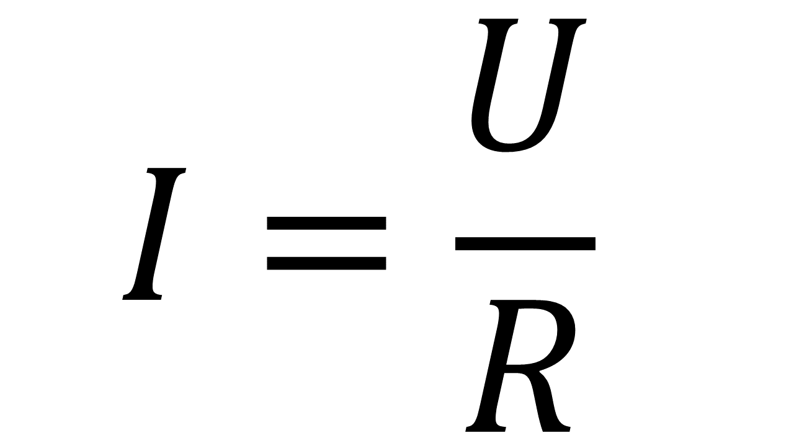
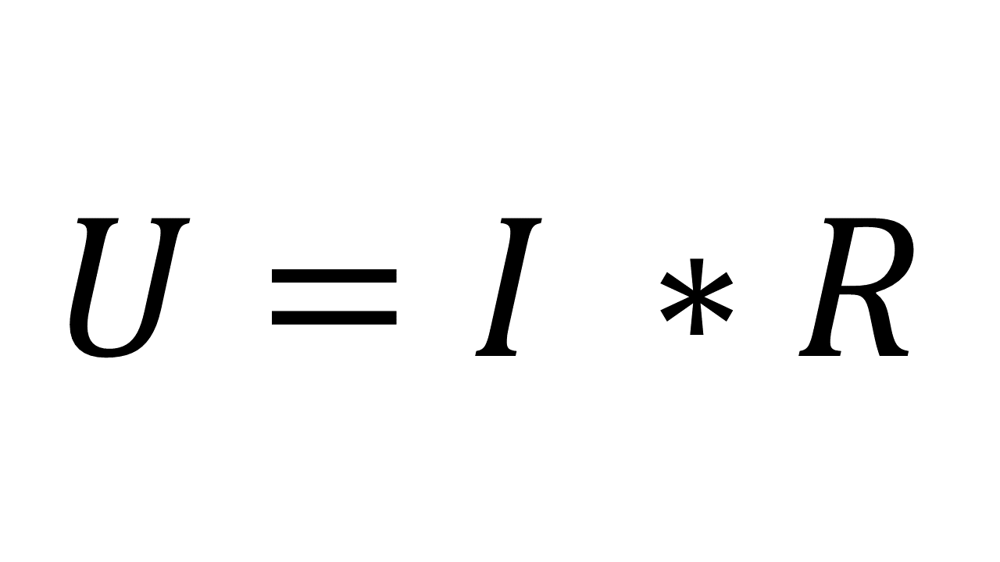
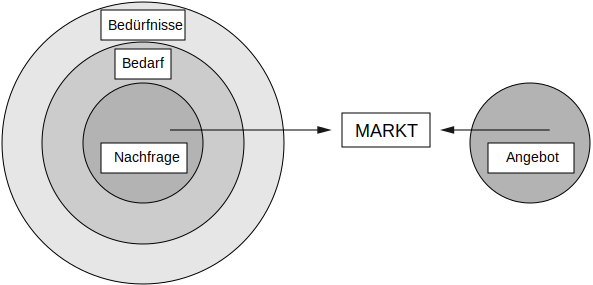
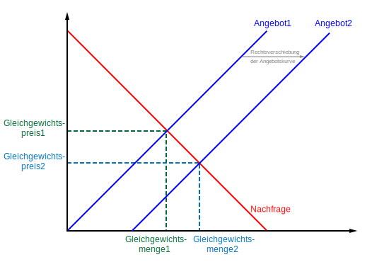

# Projekmanagement
- ## Magischen Dreieck
- ## SMART
- ## Stakeholder
- ## Projektphasen
- ## Gantt-Diagramm
- ## Netzplan
- ## Kritscher Pfad
- ## Wasserfallmodell
- ## Agile Modelle
- ## SCRUM
# Qualitätsmanagement
- ## Qualitäts-Aspekten
- ## Kano-Modell
- ## DIN EN ISO IEC
- ## Grundsätze
- ## 9000 9001 9004
- ## Zyklus
- ## Qualitätsmanagementsysteme
- ## Qualitätsplanung und Politik
- ## Schritten
- ## TQM und EFQM
- ## Softwarequalitätmerkmale
- ## 4 Testarten
# Datenschutz
- ## DSGVO und DBSG
- ## Recht auf Auskunft, berechtigung, Lösung
- ## Datenschutzbeauftragter
- ## Einschätzung Verstoßen gegen DSGVO und DBSG
- ## Gewährleistungsziel von Anfoderungen DSGVO
# IT-Sicherheit
- ## Identitätsdiebstahl und Schadeprogramm
- ## Maßnahmen gegen die Gefährdung
- ## IT-Grundschutz(BSI)
- ## Vertraulichkeit Integrität Verfügbarkeit
- ## IT-Sicherheitsgesetz
- ## Mindmap
- ## Verschlüsselung
- ## Datensicherung
- ## RAID
- ## Strukturanalyse, Schutzbedarfsfeststellung, Modellierung
- ## Authentifizierung
# IT-Systeme
- ## Analyse der marktgängigen IT-System
- ## Open Source,GNU GPL,Public Domain
- ## Parallele und Serielle
  - ### SATA (Serial ATA)
    Punkt zu Punkt Verbindung
    Jedes Geräte über separate Leitung angeschlossen
    SATA 1.5 3.0 6.0
- ## Dezentralen und Zentralen -IT Infra
  - ## 
- ## Datenübertragungsrate
- ## HD und SSD
- ## Dezimalzahl und hexadezimalzahl
- ## Stromversorung
  - ### Formel von Spannung Stromsträk und Wiederstand
  - 
  - 
  - 
- ## Einheiten
- ## Schaltplanung
- ## Dateiformaten 
- ## Bilddaten berechnen
- ## Kodierung
- ## Cloud computing
- ## IAAS PAAS SAAS
- ## DIN VDE 100-410
- ## Betriebssystem
- ## VGA DVI-D HDMI1 HDMI2 displayport
  - ### VGA (Vedio Graphics Array)
    bis 1280 X 720 Pixel
    No Sound
  - ### DVI (Digital Visual Interface)
    bis 1920 X 1080
    No Sound
  - ### HDMI 1
    bis 3840 X 2160 mit 30 Hz
  - ### HDMI 2
    bis 3840 X 2160
  - ### DP 1.2 und 1.3
    bis 3840 X 2160
- ## USB-C (Type-C)
- ## Industrie 4.0
# Software
- ## Programmierungssprach mindmap
- ## Pseudo-Code
- ## Algorithmus
- ## HTML und XML
- ## UML
- ## use-case
- ## IDE
- ## Compiler, Linker, Interpreter
- ## Variablen, Datenstrukturen, Kontrollstrukturen, Funktionen, Klassen, Vererbung
- ## Debugging, Fehlersuche
- ## Softwarelebenszyklus
- ## Programmablaufplan
- ## Struktogramm
- ## Abnahmeprotokoll, Benutzerdokumentation, Kundendokumentation, Programmdokumentation
- ## Datenbanken
- ## Entity-Relationsship-Diagramm
- ## Normalisierung
- ## SQL
# Netzwerk
- ## OSI-Modell
- ## WLAN
- ## Verkabelung
- ## Glasfaser
- ## IP-Addressen
- ## DHCP
- ## IPv6
- ## Kupferkabel
- ## Fehlersuche
- ## Netzwerkkomponenten (WLAN, LAN, Router, Switch, AP, Netzwerkprotokolle, Funktechniken)
- ## Kenngrößen, Leistungsdaten, usw.
# Arbeits- und Geschäftsprozesse
- ## Marktform
  - ## Nach der Anzahl der Anbieter werden drei verschiedene Marktformen definiert: (根据供应商的数量，定义了三种不同的市场形式)
    -  Monopol 垄断（唯一供应商）
       1 Anbieter => mehrere Nachfrager
       Gar kein Konkurrenz
    -  Oligopol (wenige Anbieter) 寡头垄断（少数供应商）
       Weniger Anbieter => mehrere Nachfrager
        - vorteile:
         - Höhe Gewinn durch weniger Konkurrenz
         - Weniger Anbieter, Weniger Preiskampf
         - Weniger Investoren ins Werbung
        - Nachteile:
         - Kunden kann leicht Preis vergleichen
         - Höhe Preis für Verbraucher
         - Mangel an Wettbewerb => Mangel an Innovation
    -  Polypol (viele Anbieter) （许多供应商）
       mehrere Anbieter => mehrere Nachfrager
       Vollkommende Konkurrenz
- ## Käufer- Verkäufermärkte
- ## Nachfrage - Angebot
  

  Bedürfnisse => Bedarf => Nachfrage

  - ### Abstrakt und Konkrete Markt
  Abstrakte Markt ist
   - theoretische Ort
   - wo Angebot und Nachfrage treffen und Preibildung steht.

  Konkrete 
   - sachliche zeitlich und örtliche Markt.
- ## Art der Markten nach
  - ## staatlichen Beeinflussung (国家影响的程度)
    - Freie Markt
    - Regulierte Markte
  - ## Marktzutrittsmöglichkeit (市场进入机会的范畴)
    - Offene Markte
    - Geschlossene Markte
  - ## Stellung von Betrieb (公司在市场中的定位)
    - Beschaffung Markte
    - Absatz Markte
  - ## Art der gehandelten Sachgüter und Leistung (交易的商品和服务类型)
    - Werkstoffmarkte
    - Arbeitsmarkte
    - Geld und Kapitalmarkte
    - Informationsmarkte
  - ## Art der Verwendung der Sachgüter und Leistung (有形商品和服务的使用类型)  
    - Investitionsgütermarkte (资本)
    - Konsumgütermarkte (消费)
  - ## Geografischen
    - Inlandsmarkt
    - Auslandsmarkt
  - ## Räumlichen-zeitlichen
    - Zentralisiert
    - Dezentralisiert
  - ## Marktposition
    - Verkäufer (Nachfrage => Angebot)
    - Käufer (Angebot => Nachfrage)
  - ## Vollkommenheit (透明度)
- ## Preisbildung
  - ## Kurve der Nachfrage
  
   Preis höher, Nachfrage weniger
   Preis nideriger, Nachfrage mehr
  - ## Kurve der Angebot
  
   Preis höher, Angebot mehr,
   Preis nideriger, Angebot weniger
  
- ## Funktionen des Preises
  - Ausgleichfunktion
  - Lenkungsfunktion
  - Signalfunktion
  - Erziehungsfunktion
- ## Geldstöme
- ## Aufbau Organisation und Geschäftsprozessen
- ## Führungsstil
- ## Handlungsvollmacht Artvollmacht Einzelvollmacht
- ## Prokurist
- ## Unternehmensleitbilder
- ## Ökonomisch und Nicht Ziel
- ## Kennzahlen
- ## Kostenberechnen
- ## Kredit und Leasing Kosten
- ## Wertschöpfungskette
- ## Kern und Unterstützungsprozessen
- ## ABC-Analyse
- ## Optimale Bestellmenge
- ## Bestandsentwicklung
- ## eEPK
- ## Recht- und Geschäftsfähigkeit
- ## Anfrage Angebot Anpreisung
- ## AGB
- ## Eigentumsvorbehalt
- ## Kaufvertragspflichten und Störung
- ## Art von Vertrag
- ## Mängel, Mängelarten
- ## Rechnung
- ## Marketing
