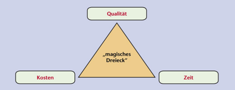
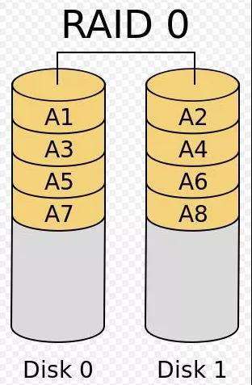
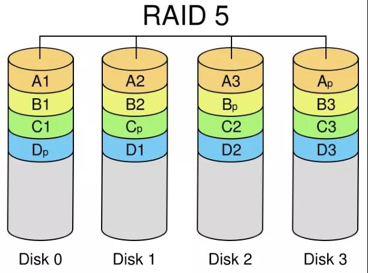
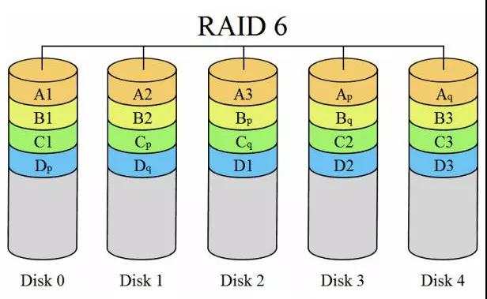
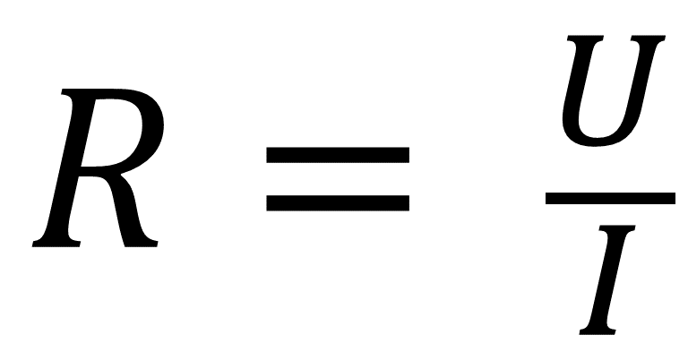
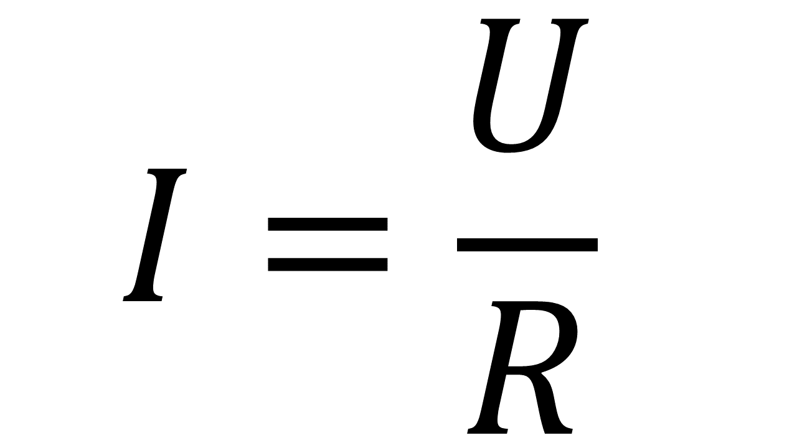
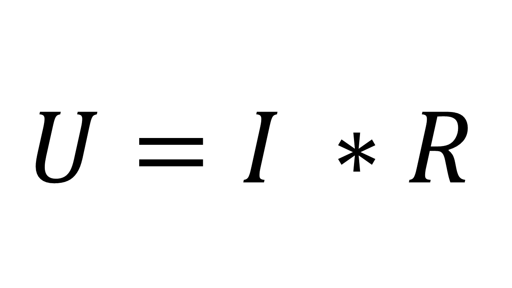
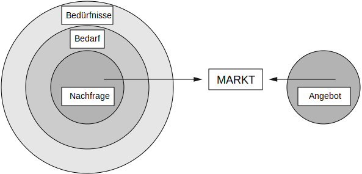
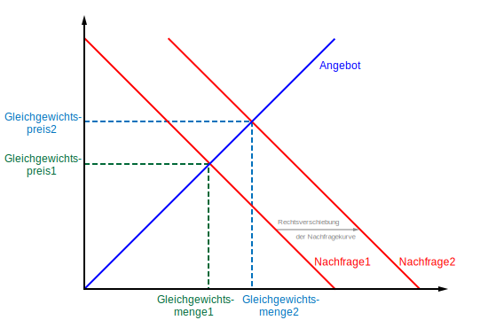
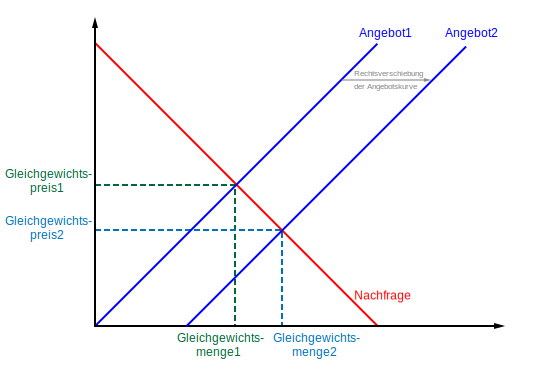

# Projekmanagement
- ## Definition
  - Projekt ist einmaliges Vorhaben mit klarem Ziel und einem definierten Anfang und Ende Termin. Also ist Zeitlich befristet. 

- ## Rahmenbedingungen von Projekts
  - Wirtschaftliche (maximale Kosten)
  - Technische (technische Standards)
  - Rechtliche (Datenschutz-Grundverordnung)
  - Terminliche (Start und End- Termin)
  - Organisatorische (Organisationsform des Proejektes)
- ## Kenngrößen des Projekts 
  -  Kenngrößen ist dafür, den Fortschrift, den Erfolg und Wirksamkeit eines Projekts zu messen und bewerten.
     - Zeit (每个步骤进度所需的事件)
     - Kosten (所有的人工，材料和设备成本)
     - Qualität (是否符合标准)
     - Umfang (范围，项目需要完成的任务)
     - Risiko (潜在的危险)
     - Fortschritt (进度)
- ## Magischen Dreieck
  
- ## SMART
  - Damit Manager Fokus auf wesentliche Sache legen kann und Projekt Effektiver ausführen kann.

  - S ===> 	spezifisch (Ziel sollte konkrete und spezifisch wie möglich formulieren)
  - M	===>	messbar (Ziel sollte so definieren, dass Fortschritt nachfolgen kann)
  - A	===>	attraktiv (Ziel sollte für allem reizvoll)
  - R	===>	realistisch (Ziel sollte umsetzbar)
  - T	===>	terminiert (Ziel sollte zeitlich geplant werden)
- ## Stakeholder
  - sind die Personen, die direkt oder indirekt mit Projekt zu tun haben.
  - Können von Projekt beeinflusst oder Einfluss auf Projekt haben.
  -	Projektleiter
  -	Projektmitarbeiter
  -	Kunden
  -	Benutzer
  -	Auftraggeber
  -	Sponsoren (赞助商)
- ## Projektphasen
  -	Projektauftrag / Definition => Machbarkeitanalyse (Technisch, Wirtschaftlich, Organisatorisch)
  -	Projektplanung => Gantte Planung und Netzplan
  -	Projektdurchführung => Gantte Planung
  -	Überwachung und Testen
  -	Projektabschluss
- ## Aufgaben von Projektmanagement
  -	Planung
  -	Organisation
  -	Personaleinsatz
  -	Führung
  -	Kontrolle
- ## Gantt-Diagramm
- ## Netzplan
- ## Kritscher Pfad
- ## Wasserfallmodell
  - ### Dokumentgetrieben (Wasserfall auch Dokumentgetrieben genannt.)
    Alle Phasen von Wasserfallmodell müssen Dokumentiert werden.
    In jeder Phase ist jeder abgeschlossene Dokumentation ein Meilestein.
  - ### Top-Down Method
    Ist die Vorgehensweise von Wasserfallmodell. Geht von Oben nach Unter.   
    Anforderung => Entwurf => Implemention => Test => Abgabe
  - ### Vorteile
    - einfach und strukturiert
    - Jeder Phasen dokumentiert
    - wenige Management Aufwand
  - ### Nachteile
    - Wenige Flexbität
    - Kein Rücksprungmöglichkeit
    - Kunden wenig beteiligt 
- ## Agile Modelle
  - ### Agile Methoden
    ist die Vorgehensweise, die agile Prinzip umsetzt. z.B: Scrum, Kanban. Dies helft die Softwareentwicklung schnell auf die Änderungen zu reagieren.
  - ### Agile Prozess
    Ist der gesamte Prozess von Softwareentwicklung, die auf agile basiert. Damit das Entwicklungsteam schnell auf die Änderung reagieren kann.
- ## SCRUM
  - ### Three Rolle
    - Product Owner => Features Design und schnittestell zwischen Kunden und Master und Team
    - Scrum Master => entwicklungsteam verwalten. Unabhängig von Entwicklungsteam
    - Scrum Team => entwicklen und testen und besteht aus 3 bis 9 Personen. aus Entwickler, Tester und Architekten
    - Stakeholder => kann jeder Zeit prozess mitmachen
  - ### Process und Workflow
    - User Stories => by product owner
    - Product Backlog => by product owner und Scrum Master
    - Sprint Backlog => by Scrum Master und Team
    - Sprint und Daliy Scrum (15 min meeting) => by Scrum Master und Team
    - Sprint review by Scrum Master und product Owner
    - Finish work 
  - ### Process of Sprint
    - Planning (Design) => Build => Test => Review
    - Ein Sprint darf nicht unterbrechen.
    - Dauern 1 bis 4 Wochen
- ## Abgabe Projekt
  - ### Protokolle
    - Benutzerdokumentation
    - Programmdokumentation
    - Schnittestelledokumentation
    - Testprotokoll
- ## Risiken und Gegenmaßnahmen von Projekten
  - zu hohe Projektkosten => Kostenplanung und Amorisationsrechnung
  - Verstoß gegen Datenschutzgesetz => Festlegung und Anwendung von Datenschutzrichtlinien
  - Datensicherheitproblem => Festlegung und Anwendung von Datensichheitrichtlinien
# Qualitätsmanagement
- ## Kriterien von Produkt
  - ### Zuverlässigkeit
  - ### Skalibarkeit
  - ### Wartbarkeit
  - ### Benutzerfreudlichkeit
- ## Kriterien von Dienstleistungen
  - ### Freundlichkeit
  - ### Fachliche Kompetzenz
  - ### Zuverlässigkeit
  - ### Erreichbarkeit
  - ### Kommunikaitonsfähigkeit von Mitarbeiter
- ## Pilot (Probe)
  - ### Weitere Projektplanung einsetzen
  - ### Abgleich Ist-Soll Stand
  - ### Stabilität
  - ### Fehlertoleranz
  - ### Kundenzufriendenheit
- ## Struktur
  - ### Philosophie
    TQM und EFQM
  - ### Qualitätsmanagement
    Qualitätspolitik
    Qualitätsprüfung
    Qualitätslenkung
    Qualitätssicherung
    Qualitätsplanung
  - ### Qualitätsaspekten
    Norm => DIN EN ISO 9000 ff. => DIN EN ISO 9001 und 9004
- ## Kano-Modell
  
- ## DIN EN ISO IEC
  - ### DIN
    Deutsches Institut für Normung
  - ### EN 
    Europäisches Normungsinstitut
  - ### ISO
    International Organisation for Standardization  
  - ### IEC
    International Electrotechnical Commission
  
  Normen muss nicht durchgeführt werden. Es gibt kein Strafgeld.
- ## 7 Grundsätze von Qualitätsmanagement
  - ### Kundenorientierung (以顾客为关注焦点)
  - ### Verantwortlichkeit der Führung (领导作用)
  - ### Einbeziehung der Mitarbeiter (全员参与)
  - ### Prozessorientierter Ansatz (过程导向的方法)
  - ### Systemorientierter Ansatz 
  - ### Kontinuierliche Verbesserung (持续改进)
  - ### Sachbezogener Entscheidungsfindungsansatz (遵守决策)
  - ### Lieferantenbeziehungen zum gegenseitigen Nutzen (互利的供应商关系)
- ## DIN EN ISO 9000 ff.
  - Ist ein Normenreihe
  - verschiedene internationale Qualitätsnormen hat (9001, 9004)
  - die Grundlage für die Planung ,Implementierung, Zertifizierung eines normenbasierten Qualitätsmanagementssystems
- ## 9000
  - definiert Grundbegriffe der Norm und Grundsätze des Qualitätsmanagements
- ## 9001
  - definiert die Mindestanforderung an Qualitätsmanagementssystem
  - Grundlage für Zertifizierung
- ## 9004
  - gibt die Empfehlungen zur Verbesserung der Leitung eines Qualitätsmanagementsystems
- ## Zyklus (PDCA)
  - Plan => Do => Check => Act
- ## Grundbaustein der Qualitätsmanagementsysteme
  - 
- ## Qualitätsplanung und Politik
  - ## Qualitätsplanung
    Ist ein Teil von Qualitätsmanagementsysteme, wo
      - Qualitätziele festgelet.
      - Prozesse und Resourcen zum Erreichen der Ziel gerichtet.
  - ## Politik
    - Von Leitung der Unternehmen ausgedrückt, wie sollte
    - umfasst alle qualitätsbezogenen Leit- und Handlungsgrundsätze und bildet den Ramenbedingungen für alle
      Qualitätsmanagementaktivaitäten.
- ## Schritten
  - Ist Analyse => Soll-Konzept => Schulung der Mitarbeiter => QM-Handbuch verfassen => Interne Audits => Zertifizierung
- ## TQM und EFQM
- ## Softwarequalitätmerkmale
  - Zuverlässigkeit (Ob die funktionierende Funktion immer korrekt funktionieren)
  - Funktionalität (Ob die Funktionen und Anfoderungen erfüllt)
  - Benutzbarkeit (Ob es leicht zu benutzen und verständlich ist)
  - Effizienz (Ob es schnell arbeiten kann und weniger Speicherplatz braucht)
  - Wartbarkeit (Ob es problemlos updaten kann und bei Fehler schnell beheben kann)
  - Portablität (Ob es Plattformübergreifend ist)
- ## 4 Testarten
  - Modultest => Integrationstest => Systemtest => Abnahmetest
  - ## Modultest
    - Bei den wird jeder Modulen oder Komponenten getest
    - Testen durch Entwickler
    - Durch Frameworks
    - White-Box-Tests
  - ## Integrationstest
    - Bei den wird von Modultest getesten einzelnen Modulen zusammengetest.
  - ## Systemtest
    - Bei den wird komplette Software nach Anforderungen getest.
  - ## Abnahmetest
    - Bei den wird Auftraggeber die geforderten Funktionalitäten getest.
    - Black-Box-Test 
# Datenschutz
- ## 7 datenschutzrechtlichen Grundsätze
  - Datenminimierung
    - Es sollte nur notwendige Daten erhoben werden.
  - Zweckbindung
    - Erhobenen Daten sollte nur Zweck relevant sein.
  - Verbot mit Erlaubnisvorbehalt
    - Um Daten zu nutzen muss eine Erlaubnis haben
  - Datenrichtigkeit
    - Daten müssen sachlich und inhaltlich richtig sein.
  - Rechtmäßigkeit und Transparenz
    - Die Daten muss auf rechtmäßige Weise verarbeitet werden
  - Vertraulichkeit Integrität Verfügbarkeit
    - Datensicherheiten
  - Speicherbegrenzung
    - Erhobenen Daten darf nur in stimmten Zeit nach Zweck gespeichert werden.
- ## DSGVO und DBSG
  - ### DSGVO (EU-Datenschutz-Grundverordnung) regelt Europa-Ebene Datenschutzordnung
  - ### DBSG (Bundesdatenschutzgesetz) regelt Deutschlandsweite Datenschutzordnung
- ## Recht auf Auskunft, berechtigung, Lösung
  - Hat Recht auf Auskunkt Über
    - Verarbeitungszweck
    - Dauer der Speicherung
    - Empfänger der Daten
    - Herkunft der Daten
  - Hat Recht auf Berichtigung
    - sofort ergänzen nicht korrekter personenbezogner Daten
  - Hat Recht auf Löschung, Wenn
    - Die Daten für Zweck nicht mehr notwendig
    - Person widerruft die Einwilligung
    - Die Daten wurde unrechtmäßig erhoben
- ## Datenschutzbeauftragter
- ## Einschätzung Verstoßen gegen DSGVO und DBSG
  - Name. Vorname, E-Mail, Telefon, Geburtsdatum, Familienstand
  Geburtsdatum und Familienstand sind nicht zwingend zu erheben
  - 
- ## Gewährleistungsziel von Anfoderungen DSGVO
# IT-Sicherheit
- ## Identitätsdiebstahl und Schadeprogramm
  - ### Identitätsdiebstahl 
  - Phishing (钓鱼)
    Mithilfe von fake Webseite und E-mail wird daten ermittelt.
  - Vishing (电话钓鱼)
    Mithilfe von Telefon
  - Pharming (域嫁接)
    Damit wird die DNS angeriffen und auf fake Webseite umgeleitet.
  - Spoofing (伪造身份验证)
    Damit wird Identität von Angreifer verfälschen.
  - Nicknapping (身份盗窃)
    Damit wird die Internet-Identität von Person gestohlen
  - ### Schadeprogramm
  - Spam (垃圾邮件)
    Unaufgeforderte Senden von Nachricht und Emails
  - Spyware (间谍软件)
    Die Information von Benutzer oder Beamten ausspähen
  - 
- ## Maßnahmen gegen die Gefährdung
- ## IT-Grundschutz(BSI)
- ## Vertraulichkeit Integrität Verfügbarkeit
  - ### Vertraulichkeit
    Die Daten darf nur von autorisierte Person zugreifen.
  - ### Integrität
    Die Daten sollte korrekt und vollständig sind und nicht durch anderem verändert
  - ### Verfügbarkeit
    Die Daten sollte jeder zeit von autorisierte person zugreifen können und nicht durch technische Störung beeinträchtigt.
- ## IT-Sicherheitsgesetz
- ## Mindmap
- ## Verschlüsselung
- ## Datensicherung
- ## RAID
- ## Strukturanalyse, Schutzbedarfsfeststellung, Modellierung
- ## Authentifizierung
# IT-Systeme
- ## Ticket System
  - ### First-Level-System
  - ### Second-Level-System
- ## Zentralen und Dezentralen IT-Infrastruktur
  - ### Vorteile von Zentralen
    - Anschaffungsrabatte
    - Weniger Administrator
  - ### Vorteile von Dezentralen
    - Flexbilität
    - Fehlerminimierung
- ## Datenvolumen Einheiten
  - 1 Bit = 8 Byte
  - 1000 Byte     = 1 KiloByte
  - 1000 KiloByte = 1 MegaByte
  - 1000 MegaByte = 1 GigaByte
  - 1000 GigaByte = 1 TeraByte
  - 1000 TeraByte = 1 PetaByte

  - 1000 Byte     = 1 Kibibyte
  - 1000 Kibibyte = 1 Mebibyte
  - 1000 Mebibyte = 1 Gibibyte
  - 1000 Tebibyte = 1 Pebibyte
- ## RAID
  - (Redundant Arrary of Independent Disks)
  - Datenspeicherung auf verschiedenen Festplattenlaufwerk verteilt gespeichert werden
  - Parity Information und Fehlerkorrekturcodes ist für Datenwiederherstellung, wenn Teil der Daten verloren ist.
  - Software-RAID und Hardware-RAID
    - Sotware-RAID wird von Betriebssystem gesteuert und kein extra Controller braucht.
    - Belastet CPU
  - Hardware-RAID
    - brauchte extra Controller auf Motherboard
    - Unhängig von CPU
    - auch als DAS (Direct Attached Storage)
  - In Firmen wird durch Datenaustausch zwischen Festplatten durch intranetInternet. hier auch als NAS (Network Attached Storage) genannt
  - Entweder mit SATA oder SAS-Festplatten
  - Levels
    - 0  
    - Zerlegen Daten in Blöcke und gleichmäßig verteilt auf allen Platten.
    - Mindestens Zwei Festplatten
    - Großer Kapazität
    - Wenn ein Platte daten verlust, dann verlust alle Daten.
      
    - 1
    - Allen Daten werden mehrmals auf allen Platten geschrieben(Clone)
    - Mindestens Zwei Festplatten
    - Weniger Kapazität
    - Bei Ausfall einer Platte verliert kein Daten
      
    - 5 
    - Allen Daten und eine zusätzlichen Parity-information werde verteilt auf allen Platten gespeichert werden
    - Mindest Drei Festplatten
    - Bei Ausfall einer Platte könnte Raid von anderen Daten mit dazugehörigen Parity-information zusammenausrechnen. Also sichere als RAID 2
    - Jeder Platte hat 20% Kapazität weniger
      
    - 6
    - Allen Daten und mehreren zusätzlichen Parity-Information werden verteilt auf allen Platten gespeichert werden
    - Mindest vier Festplatten
    - Bei Ausfall mehreren Platte könnte Raid von anderen Daten mit dazugehörigen Parity-information zusammenausrechnen. Also sichere als RAID 5, aber teuere als 5
      
    - 10
    - Kombination 0 mit 1, Allen Daten in Blöcke und ihre Clone gleichmäßig verteilt auf allen Platten
    - Mindest vier Festplatten
- ## Backup
  - ### VollDatensicherung
    - Allen Daten werden gespeichert werden
    - Vorteile:
      - Prozess einfach
      - Einfach Wiederherstellen
    - Nachteile:
      - Große Zeitlich Aufwand
  - ### Differentiellensicherung
    - Zunächst Vollsichrung und dann wurde alle Daten, die seit letzte Vollsicherung geänderte wurden, gespeichert.
      - Vorteile:
        - Schneller als Vollbackup
      - Nachteile:
        - nicht effizient, sobald eine änderungen besteht, muss Sicherung durchführen
        - Brauch mehr speicherplatz
  - ### Inkrementellensichrung
    - Zunächst Vollsichrung und dann wurde alle Daten, die nach jeweils letzten Sicherung geänderte wurden, gespeichert.
      - Vorteile:
        - Effizient, jedes mal muss kleine Änderungen speichern
        - schnell erlediglich
      - Nachteile:
        - langsame wiederherstellung
- ## Virtualisierung
  - ist eine Simulation von physischer Hardware. Dabei wird virtuelle Betriebssystem, Speicher und Netzwerk Ressourcen erzeugen.
  - Server-Virtualisierung
    - Ein Physischer Host darauf mehrere Virtuelle Server 
  - Speicher-Virtualisierung
    - Mehrere Physischer Host zusammenbinden, um eine Speicherpool zu erzeugen 
  - Vorteile:
    - Geringe Anschaffungskosten
    - Physischer Host ausnutzen
  - Nachteile:
    - Ausfall alle Virtuelle Server, wenn Host ausfall
    - Schlecht für Host
- ## USV
  - ### Ununterbrechungsstromversorgung
    Schützt vor potenziellen unerwartete Ausfall von Strom. Dadurch bleibt Rechnerzentrum am Laufen, nicht sofort ausschalten. USV wird die Stromversorgung von allen Geräten ausgleichen. So hat man noch Zeit um Daten zu retten.
- ## Analyse der marktgängigen IT-System
- ## Open Source,GNU GPL,Public Domain
- ## Parallele und Serielle
  - ### SATA (Serial ATA)
    Punkt zu Punkt Verbindung
    Jedes Geräte über separate Leitung angeschlossen
    SATA 1.5 3.0 6.0
- ## Datenübertragungsrate
- ## HD und SSD
- ## Dezimalzahl und hexadezimalzahl
  - ### Dezimal in Dualzahl => Dezimal Zahl immer durch 2
  - ### Dualzahl in Dezimalzahl
    1   1   1   1   1   1   1   1
    128 64  32  16  8   4   2   1
  - ### Dualzahl in Hexadezimalzahl =>
    1 1 1 1   1 0 1 0   1 1 1 1
    15 => F   10 => A   15
    
    10 => A
    11 => B
    .......
    15 => F
- ## Stromversorung
  - ### Formel von Spannung Stromsträk und Wiederstand
  - 
  - 
  - 
- ## Schaltplanung
- ## Dateiformaten 
- ## Bilddaten berechnen
- ## Kodierung
- ## Cloud computing
  - ### Vorteile: 
    - Dadurch weniger Adminstrator brauchen
    - Dadurch weniger Hardware Kosten
  - ### Nachteile:
    - Sehr Internetabhängig
    - Problem Schutz vor Daten
  - ### Public Cloud
    - von Cloud Provider anbieten (Azure, AWS)
    - Kein Kontroll auf physischer Server
    - weniger Datensicherung
  - ### Private Cloud
    - Server liegt bei Unternehmen
    - Kontroll auf physischer Server
    - mehr Datensichrung
  - ### Hybrid Cloud
    - eine Kombination von Public und private Cloud
- ## IAAS PAAS SAAS
  - ### Plattform as a service (SAP Cloud, AWS Lambda)
  - nur Hardware und Plattform anbieten. Inhaltlichen Anwendungen App muss kunden selbst entwicklen
  - ### Software as a service (Office 365)
  - wird ein Software Produkt ausliefern, seinem IT-Infrastruktur und Plattform liegt aber bei externen IT-Dienst. Kunden errecht über Internet
  - ### Infrastructur as a service (AWS, Azure)
  - nur Hardware anbieten auch als Cloud genannt. Plattform und App muss kunden selber verwalten und entwicklen.
- ## DIN VDE 100-410
- ## Betriebssystem
- ## VGA DVI-D HDMI1 HDMI2 displayport
  - ### VGA (Vedio Graphics Array)
    bis 1280 X 720 Pixel
    No Sound
  - ### DVI (Digital Visual Interface)
    bis 1920 X 1080
    No Sound
  - ### HDMI 1
    bis 3840 X 2160 mit 30 Hz
  - ### HDMI 2
    bis 3840 X 2160
  - ### DP 1.2 und 1.3
    bis 3840 X 2160
- ## USB-C (Type-C)
- ## Industrie 4.0
# Software
- ## Programmierungssprach mindmap
  - Programmierparadigma (编程范式)
  - ### Das "Wie" steht im Vordergrund
    - Imperative Programmierung (命令式编程)
      - Prozedurale Programmierung (面向过程) => C
      - Objektorientierte Programmierung (面向对象) => Java C#
      - Strukturierte Programmierung (面向结构) => C++ Fortran
    - Deklarative Programmierung (声明式编程)
      - Funktionale Programmierung (函数式编程) => ECMAScript
      - Logische Programmierung (逻辑编程) => SQL
  - ### Das "Was" steht im Vordergrund
- ## Art der Software
  - ### Standardsoftware
    - für einen klar definierten Zweck eingesetzt.
    - Vorfertigesproduckt
    - in unterscheidlichen Bereichen einsetzbar
  - ### Individualsoftware
    - speziell für Wunsch von Kunden
  - ### Branchensoftware
    - eine Art von Standardsoftware, aber nur für speziellen Markt und Branchen
- ## Libraries und Frameworks
  - ### Libraries
  - Vorfertiges Produkt
  - sofort benutzbar
  - kein speziellen Regel zu halten
  - ### Frameworks
  - Halbfertiges Produkt
  - nur Grundgerüst, muss erst konfigurieren
  - muss auf speziellen Regel zu halten
- ## Ergonomische Prinzipien
  - ### Aufgabenangemessenheit (geeignete Funktionalität, minimierung unnötiger Interaktion)
  - ### Selbstbeschreibungsfähigkeit (Verständlichenkeit durch Rückmeldung)
  - ### Fehlertoleranz (unbekannte Fehler verhindern)
- ## Barrierenfreiheit am Arbeitsplatz
  - ### Maßnahmen Sehvermögen
  - ### Maßnahmen Hörvermögen
  - ### Maßnahmen motorische Fähigkeiten
- ## Pseudo-Code
- ## Algorithmus
- ## HTML und XML
- ## UML
- ## use-case
- ## IDE
- ## Compiler, Linker, Interpreter
- ## Variablen, Datenstrukturen, Kontrollstrukturen, Funktionen, Klassen, Vererbung
  - ### Klassen
    - Element von OOP, die mehreren Variablen und Funktionen enthalten.
  - ### Vererbung
    - Klassen und Klassen können miteinander vererbt werden.
  - ### Funktion
    - Durch Funktion wird definiert, wie die Variablen verhalen sollen.
- ## Debugging, Fehlersuche
  - ### Funktionen von Debugging
    - Breakpunkt setzen
    - Zeilen für Zeilen ausführen
    - Werte von Varibale auslesen im Laufen des Programm
- ## Softwarelebenszyklus
- ## Programmablaufplan
- ## Struktogramm
- ## Datenbanken
- ## Entity-Relationsship-Diagramm
- ## Normalisierung
- ## SQL
# Netzwerk
- ## OSI-Modell
- ## WLAN
- ## Verkabelung
- ## Glasfaser
- ## IP-Addressen
- ## DHCP
- ## IPv6
- ## Kupferkabel
- ## Fehlersuche
- ## Netzwerkkomponenten (WLAN, LAN, Router, Switch, AP, Netzwerkprotokolle, Funktechniken)
- ## Kenngrößen, Leistungsdaten, usw.
# Arbeits- und Geschäftsprozesse
- ## Marktform
  Nach der Anzahl der Anbieter werden drei verschiedene Marktformen definiert: (根据供应商的数量，定义了三种不同的市场形式)
    -  Monopol 垄断（唯一供应商） 
      - 1 Anbieter => mehrere Nachfrager  
      - Gar kein Konkurrenz  
      - Beispiel: Deutsche Bahn, Deutsche Post  
    -  Oligopol (wenige Anbieter) 寡头垄断（少数供应商） 
      - Weniger Anbieter => mehrere Nachfrager  
      - Gleichgewichte Konkurrenz  
      - Beispiel: Lebensmittelladen, Wohnungsmarkte  
    -  Polypol (viele Anbieter) （许多供应商） 
      - mehrere Anbieter => mehrere Nachfrager  
      - Vollkommende Konkurrenz  
      - Beispiele: Internet Provider,  Automobilindustrie  

    - vorteile von Oligopol:
         - durch weniger Anbieter ist Preiskampf 
         - durch weniger konkurrenz auch weniger investition ins Werbung
    - Nachteile von Oligopol:
         - durch weniger Anbieter ist Mangel an Innovation
         - Anbieter können untereinander verhandeln, eine illegale Preis geben
- ## Käufer- Verkäufermärkte
- ## Nachfrage - Angebot
  

  Bedürfnisse => Bedarf => Nachfrage

  - ### Abstrakt und Konkrete Markt
  Abstrakte Markt ist
   - theoretische Ort
   - wo Angebot und Nachfrage treffen und Preibildung steht.

  Konkrete 
   - sachliche zeitlich und örtliche Markt.
- ## Art der Markten nach
  - ## staatlichen Beeinflussung (国家影响的程度)
    - Freie Markt
    - Regulierte Markte
  - ## Marktzutrittsmöglichkeit (市场进入机会的范畴)
    - Offene Markte
    - Geschlossene Markte
  - ## Stellung von Betrieb (公司在市场中的定位)
    - Beschaffung Markte
    - Absatz Markte
  - ## Art der gehandelten Sachgüter und Leistung (交易的商品和服务类型)
    - Werkstoffmarkte
    - Arbeitsmarkte
    - Geld und Kapitalmarkte
    - Informationsmarkte
  - ## Art der Verwendung der Sachgüter und Leistung (有形商品和服务的使用类型)  
    - Investitionsgütermarkte (资本)
    - Konsumgütermarkte (消费)
  - ## Geografischen
    - Inlandsmarkt
    - Auslandsmarkt
  - ## Räumlichen-zeitlichen
    - Zentralisiert
    - Dezentralisiert
  - ## Marktposition
    - Verkäufer (Nachfrage => Angebot)
    - Käufer (Angebot => Nachfrage)
  - ## Vollkommenheit (透明度)
- ## Preisbildung
  - ## Kurve der Nachfrage
  
   Preis höher, Nachfrage weniger
   Preis nideriger, Nachfrage mehr
  - ## Kurve der Angebot
  
   Preis höher, Angebot mehr,
   Preis nideriger, Angebot weniger
  
- ## Funktionen des Preises
  - Ausgleichfunktion
  - Lenkungsfunktion
  - Signalfunktion
  - Erziehungsfunktion
- ## AIDA
  - Kunden zum Kaufabschluss zu führen
  - ### Attention (Aufmehrsamkeit)
    - Den Kunden aufmehrsam machen
  - ### Interest (Interesse)
    - Den Interesse von Kunden wecken
  - ### Desire (Verlangen)
    - Den Wunsch von Kunden wecken
  - ### Action
    - Lass Kunden kaufen
- ## Monetäre und nicht monetäre Anreiz von Mitarbeiter
  - ### Monetäre
    - Bonus nach Projekt geben
    - Weihnachtgeld und Urlaubgeld
  - nicht monetäre
    - Homeoffice
    - gute Hardware Unterstützung
- ## Anwendungssytem drei Ebenen
  - Strategische Ebenen
  - Management Ebenen
  - Operative Ebenen
- ## Präsentation
  - ### Weniger Grafiken und Animation
  - ### Context folgen
  - ### Zielgruppen klarmachen
  - ### Kurze Text
- ## Geldstöme
- ## Aufbau Organisation und Geschäftsprozessen
- ## Führungsstil
- ## Handlungsvollmacht Artvollmacht Einzelvollmacht
- ## Prokurist
- ## Unternehmensleitbilder
- ## Ökonomisch und Nicht Ziel
- ## Kennzahlen
- ## Kostenberechnen
- ## Kredit und Leasing Kosten
- ## Wertschöpfungskette
- ## Kern und Unterstützungsprozessen
- ## ABC-Analyse
- ## Optimale Bestellmenge
- ## Bestandsentwicklung
- ## eEPK
- ## Recht- und Geschäftsfähigkeit
- ## Anfrage Angebot Anpreisung
- ## AGB
- ## Eigentumsvorbehalt
- ## Kaufvertragspflichten und Störung
- ## Art von Vertrag
- ## Mängel, Mängelarten
- ## Rechnung
- ## Marketing
- ## CRM
  - ein strategische Software, dient zum Kundenverwaltung, Dabei wurde dokumentiert, was wann wo kunden gesagt oder gemacht. 
- ## BI
  - ein Verfahren zu analysieren unternehmensdaten. Dabei wird die Daten gesammelt und auswertet und präsentiert.
- ## ERP
  - ein Software, die alle kernprozessen von unternehmen hat. 
